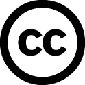
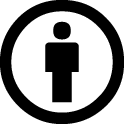
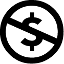

# 贡献者 Contributors

> 📑 Code 代码
> 💡 Idea 创意
> 🌏 Localization 本地化
> 🔊 Sound and Music 音效和音乐
> 🌼 Texture 材质

name|job
----|---
Firok|💡 📑 🌼 🌏
Avery|🌏
Ayero|💡
Dongguai|💡
ExplosiveMosFET|💡
Frankumjay|🔊
goulixiaoji|💡
hidfug|💡
Isaac200000|🔊
Kirisu|💡
l_sz|💡
mixmitch62|🔊
Thsaure|💡
Timbre|🔊
Wu|💡
諾炎|💡
夜凌_yorin|💡 🌼

## 关于音效和音乐 About sounds and musics

本模组所用音效和音乐均来自[Free Sound](https://freesound.org/)网站 All sounds and musics of this mod are from [Free Sound](https://freesound.org/)

您使用本模组的资源文件时, 请注意遵守相应的CC协议 When you use the resources of this mod, please pay attention to the corresponding Creative Commons license

游戏内名称 in-game name|原名称 original name|作者 author|对原作品修改 modification|遵循协议 licence|原作链接 link
-|-|-|-|-|-
Tinkers' Efforts|Electronic pop & Sweet guitar|Frankumjay|淡入和淡出音效 fade-in and fade-out effect|CC BY 3.0|[Link](https://freesound.org/people/frankum/sounds/368743/)
Tinkers' Will|Eleonor's will. - Electronic track music|Frankumjay|淡入和淡出音效 fade-in and fade-out effect|CC BY 3.0|[Link](https://freesound.org/people/frankum/sounds/453072/)
Tinkers' Imagination|dreamy remix of PapaninKasettratat's Freesound #453161|Timbre|无 none|CC BY NC 3.0|[Link](https://freesound.org/people/Timbre/sounds/454806/)
Heal Effect|Error|Isaac200000|无 none|CC0 1.0|[Link](https://freesound.org/people/Isaac200000/sounds/188013/)
Shaking Effect|Warrior KICK|mixmitch62|无 none|CC0 1.0|[Link](https://freesound.org/people/mixmitch62/sounds/459877/)
Shaking Effect|Warrior Tom|mixmitch62|无 none|CC0 1.0|[Link](https://freesound.org/people/mixmitch62/sounds/459876/)
Shaking Effect|Warrior bass T|mixmitch62|无 none|CC0 1.0|[Link](https://freesound.org/people/mixmitch62/sounds/459875/)

## 关于CC协议 About Creative Commons License

icon||中文版本|English
-|-|-|-
 |CC0 1.0|[CC0 1.0 通用 (CC0 1.0) 公共领域贡献](https://creativecommons.org/publicdomain/zero/1.0/deed.zh)|[CC0 1.0 Universal (CC0 1.0) Public Domain Dedication](https://creativecommons.org/publicdomain/zero/1.0/)
 |CC BY 3.0|[署名 3.0 未本地化版本 (CC BY 3.0)](https://creativecommons.org/licenses/by/3.0/deed.zh)|[Attribution 3.0 Unported (CC BY 3.0)](https://creativecommons.org/licenses/by/3.0/)
  |CC BY NC 3.0|[署名-非商业性使用 3.0 未本地化版本 (CC BY-NC 3.0)](https://creativecommons.org/licenses/by-nc/3.0/deed.zh)|[Attribution-NonCommercial 3.0 Unported (CC BY-NC 3.0)](https://creativecommons.org/licenses/by-nc/3.0/)
